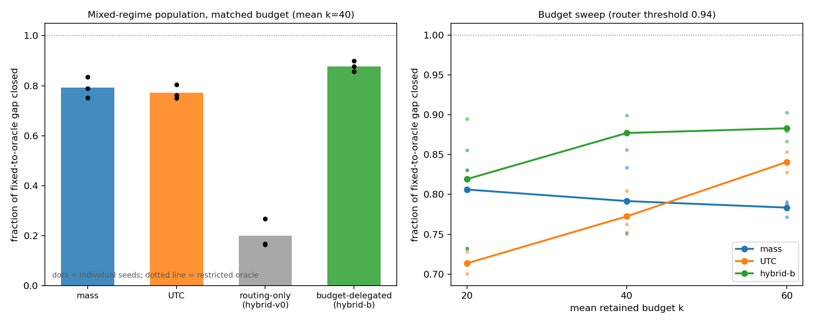

# Stage 1 Summary: Cheap Value Proxies and the Budget-Delegated Hybrid

Status: **core loop complete 2026-07-03**. Run-by-run detail in
[`docs/experiment_log.md`](../docs/experiment_log.md) (sections from "Cheap
value proxy v0" onward); v1 background in
[`reports/v1_summary.md`](./v1_summary.md).

## The Question Stage 1 Answered

v1 ended with: the value of value-awareness concentrates in the high-entropy
regime, but the restricted oracle that proves this reads dropped `V` per query
row — the exact IO sparse attention wants to save. Stage 1 asked:

```text
Can a CHEAP approximation to ||mu_R - mu_S|| recover part of the restricted
oracle advantage — and what is the right way to combine it with the strong
Q,K-only baseline (dropped mass)?
```

Answer: **yes, and the right combination is budget delegation, not routing.**

## The UTC Proxy

UTC (Uniform-Tail Centroid) approximates the dropped weighted centroid by the
unweighted tail mean:

```text
mu_R_hat = (sum_i V_i - sum_{i in S} V_i) / |R|
score(k) = delta(k) * ||mu_R_hat(k) - mu_S(k)||
```

Cost: one sequence-level precompute (`sum_i V_i`) amortized over all query
rows, plus retained values that sparse attention already reads. **Zero extra
per-row V-IO.** Design bet: the uniform-tail assumption is most accurate in
high-entropy regimes — exactly where v1 showed value information is needed.

## Findings

### 1. UTC predicts the displacement well — with an honest asterisk

`corr(UTC, trueC) >= 0.98` at every regime; survives V–K correlation up to
`V = 0.9·KM + noise`. But the headline correlation is partly carried by the
exactly-shared `mu_S` term: the *estimation core* (`mu_R_hat` vs `mu_R`)
degrades from 8.8% relative error (high entropy) to 28% (sharp), exactly as
the uniform-tail assumption predicts. Fortunately the regime where it is
accurate is the regime where it is needed.

### 2. Predictor correlation ≠ allocation quality (two instances)

In matched-budget allocation, UTC closes 66%/45% of the fixed-to-oracle gap
at the two high-entropy regimes (where dropped-mass is -6%/0%), but is
*worse than fixed* at the mid regime (-6.6%) despite predictor correlation
0.96 there. Together with entropy (low corr, bad allocation), this gives both
directions of the lesson: allocation depends on cross-row comparability of the
score near the stopping threshold, which global correlation does not measure.

### 3. The per-dataset router test was circular (methodological correction)

Routing rows by entropy looked perfect when each synthetic dataset had a
single regime — but the router never made a real per-row decision, the
threshold was in-sample, and the hybrid equaled the pointwise max of the two
pure curves by construction. Logged as a consistency check, not evidence.

### 4. On mixed-regime data, budget transfer beats signal choice

On a single population whose rows span regimes (per-row `q_scale`, threshold
0.94 held out, 3 seeds):

```text
gap closed (overall worst-row rel. error) | seed 0 | seed 1 | seed 2
mass                                       |  0.833 |  0.751 |  0.791
UTC                                        |  0.804 |  0.761 |  0.772
hybrid-v0 (routing-only)                   |  0.267 |  0.164 |  0.168
hybrid-b (budget-delegated)                |  0.855 |  0.902 |  0.878
```

- **hybrid-v0 collapses**: pinning both router branches to the same mean
  budget forbids cross-regime budget transfer, which turns out to be most of
  the value. Its earlier per-dataset "success" was the circular artifact.
- **mass is a strong cross-regime budget allocator**: a single tau reproduces
  the oracle's budget split almost exactly (~74/19 vs oracle ~76/18).
- **hybrid-b beats both pure strategies on all seeds**: mass decides how much
  budget each entropy group gets; UTC re-allocates within the high-entropy
  group, where mass is blind. Both ingredients are deployable-cheap.

Entropy's final role, after being demoted twice: not a scorer, not a router,
but the **grouping variable for a budget-respecting delegation**.

### 5. Both dangerous knobs unfixed; conclusion survives

- **Threshold sweep** (0.85–0.97): hybrid-b beats both pure strategies at
  every threshold on every seed; the threshold sits on a plateau, not a
  knife-edge.
- **Budget sweep** (mean k = 20/40/60): hybrid-b >= max(mass, UTC) in all 9
  configurations, strictly better in 7. At the tightest budget its edge
  vanishes (the overall worst row sits in the low-entropy group, which
  hybrid-b leaves untouched) — never harmful.
- Side observation (not yet established): pure UTC strengthens with budget
  and overtakes pure mass at k=60 on all seeds — the regime story possibly
  recurring along the budget axis.



Figures: `results/stage1_mixed_regime_summary.png` (method comparison +
budget sweep), `results/stage1_utc_vs_mass_gap_closed.png` (per-regime
complementarity from the per-dataset phase).

## Language Discipline

- The oracle is **restricted** (best k within top-k-by-p; one-swap showed the
  family itself is suboptimal, so all "value of V" numbers are lower bounds).
- hybrid-b is "a budget-respecting delegation scheme that beats both pure
  strategies on this benchmark" — not "the optimal hybrid." The mass-derived
  budget split is a pragmatic heuristic.
- Every effectiveness claim carries its regime qualifier.

## Caveats

Synthetic iid Gaussian values (V–K correlation probed but not exhaustively),
N=128 single-layer setting, L2 error metric (decomposition is norm-agnostic;
the downstream-induced metric via W_O is deferred to the real-data stage),
regime mixture chosen by us rather than by data.

## Next Stage

**Real attention maps.** The rig is ready: the H_norm axis, matched-budget
framework, and all deployable methods (mass / UTC / hybrid-b) transfer
directly; the oracle remains an offline measuring stick. Real data fixes what
synthetic data left arbitrary: the regime mixture, the entropy distribution,
and the value structure. Candidate sources: BERT attention (existing
extraction tooling from the bert-cluster-stability project) or GPT-2 small.
